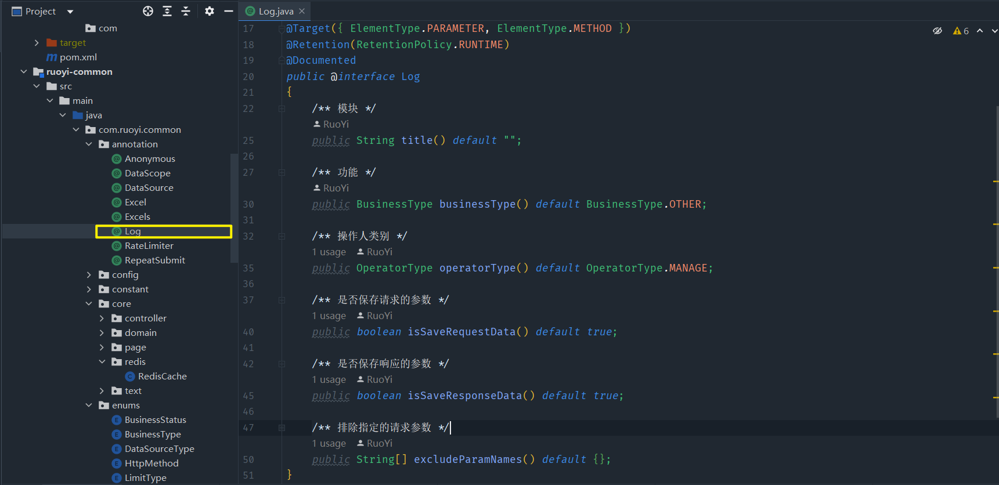
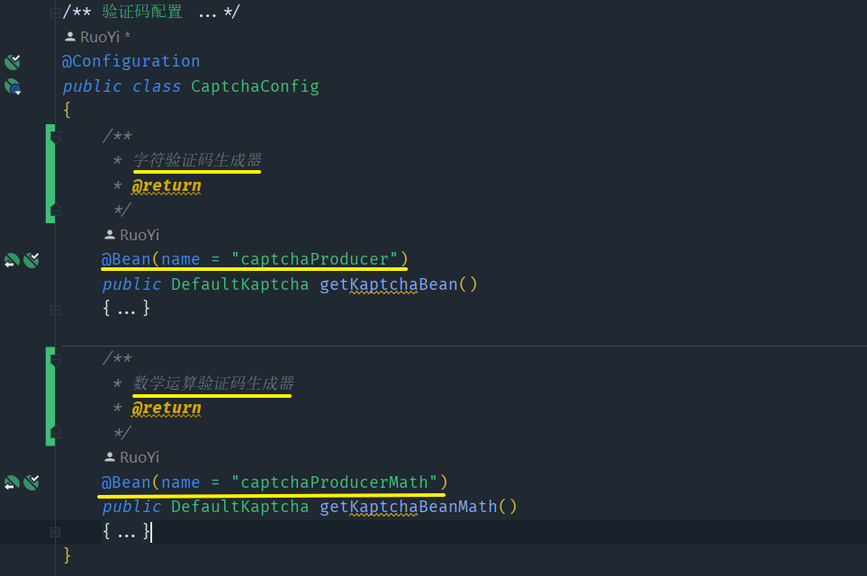

# 前言

* <b style="color:red">这只是个人对若依源码的一些解读</b>
* <b style="color:pink">菜狗摸索，有误勿喷，烦请联系</b>


## 分页查询
[分页查询]
* 相关类
1. `PageDomain`是对各种分页参数的封装体
2. `TableDataInfo`是分页查询结果返回对象
3. `TableSupport`类似工具类，提供了方法将请求中的分页参数拿出来封装成PageDomain对象

* 讲下实现逻辑
1. 这里的分页实现不像传统的在Controller中接受分页参数
2. 而是统一封装了PageUtils工具类进行分页
3. 其内部实现逻辑很简单，就是通过TableSupport类把请求参数封装成PageDomain对象，然后PageHelper.startPage()方法开启分页

   ```java
   	public static void startPage()
       {
           PageDomain pageDomain = TableSupport.buildPageRequest();
           Integer pageNum = pageDomain.getPageNum();
           Integer pageSize = pageDomain.getPageSize();
           String orderBy = SqlUtil.escapeOrderBySql(pageDomain.getOrderBy());
           Boolean reasonable = pageDomain.getReasonable();
           PageHelper.startPage(pageNum, pageSize, orderBy).setReasonable(reasonable);
       }

4. 它这里就是各种方法之间调用一开始弄得有点懵，后续看懂了其实挺快的。


## 日志记录

* 时间：2023年3月20日10:49:58
* <b style="color:red">它的实现主要是通过自定义注解 + AOP来实现的</b>


### 自定义注解@Log

* 实现代码如下：（位于`ruoyi-common`模块的`com.ruoyi.common.annotation`包下）

  

* 各个方法对应都有注释，就不啰嗦了

* 这里要特别讲一下，会牵扯到两个枚举类

  * `BusinessType`：业务操作枚举类

    ```java
    public enum BusinessType
    {
        /**
         * 其它
         */
        OTHER,
    
        /**
         * 新增
         */
        INSERT,
    
        /**
         * 修改
         */
        UPDATE,
    
        /**
         * 删除
         */
        DELETE,
    
        /**
         * 授权
         */
        GRANT,
    
        /**
         * 导出
         */
        EXPORT,
    
        /**
         * 导入
         */
        IMPORT,
    
        /**
         * 强退
         */
        FORCE,
    
        /**
         * 生成代码
         */
        GENCODE,
        
        /**
         * 清空数据
         */
        CLEAN,
    }
    ```

  * `OperatorType`：操作类别枚举类

    ```java
    public enum OperatorType
    {
        /**
         * 其它
         */
        OTHER,
    
        /**
         * 后台用户
         */
        MANAGE,
    
        /**
         * 手机端用户
         */
        MOBILE
    }
    ```

    

### 使用

* 这个比较简单，在`Controller`的接口方法上，如果需要，直接加注解以及标明各个配置值就好

* 如下所示：

  

  

### AOP的逻辑实现

* 这是位于`ruoyi-framework`模块的`com.ruoyi.framework.aspectj`包下`LogAspect`实现的

* <b style="color:red">它主要的处理逻辑就是将操作日志封装成对象（SysOperLog），设置好对应字段信息后保存到数据库的`sys_oper_log`表下</b>

* 实现代码以及注释如下所示：

  ```java
  package com.ruoyi.framework.aspectj;
  
  /**
   * 操作日志记录处理
   * 对Controller类接口方法中加了 自定义@Log注解的，采用AOP方式，做操作日志记录（比如说统计完成请求时  间）
   * 
   * @author ruoyi
   */
  @Aspect
  @Component
  public class LogAspect
  {
      private static final Logger log = LoggerFactory.getLogger(LogAspect.class);
  
      /** 排除敏感属性字段 */
      public static final String[] EXCLUDE_PROPERTIES = { "password", "oldPassword", "newPassword", "confirmPassword" };
  
      /** 计算操作消耗时间 */
      private static final ThreadLocal<Long> TIME_THREADLOCAL = new NamedThreadLocal<Long>("Cost Time");
  
      /**
       * 处理请求前执行
       */
      @Before(value = "@annotation(controllerLog)")
      public void boBefore(JoinPoint joinPoint, Log controllerLog)
      {
          // 存储请求到接口方法时的开始时间
          TIME_THREADLOCAL.set(System.currentTimeMillis());
      }
  
      /**
       * 处理完请求后执行
       *
       * @param joinPoint 切点
       */
      @AfterReturning(pointcut = "@annotation(controllerLog)", returning = "jsonResult")
      public void doAfterReturning(JoinPoint joinPoint, Log controllerLog, Object jsonResult)
      {
          handleLog(joinPoint, controllerLog, null, jsonResult);
      }
  
      /**
       * 拦截异常操作
       * 
       * @param joinPoint 切点
       * @param e 异常
       */
      @AfterThrowing(value = "@annotation(controllerLog)", throwing = "e")
      public void doAfterThrowing(JoinPoint joinPoint, Log controllerLog, Exception e)
      {
          handleLog(joinPoint, controllerLog, e, null);
      }
  
      /**
       * 实际的日志处理逻辑（这里包含了正常完成请求，以及请求出异常的状况）
       * @param joinPoint 连接点
       * @param controllerLog 自定义注解
       * @param e 请求出现异常的异常对象
       * @param jsonResult 请求完成时的返回结果
       */
      protected void handleLog(final JoinPoint joinPoint, Log controllerLog, final Exception e, Object jsonResult)
      {
          try
          {
              // 获取当前的用户
              LoginUser loginUser = SecurityUtils.getLoginUser();
              // *========数据库日志=========*//
              SysOperLog operLog = new SysOperLog();
              // 这里ordinal()方法是获取对应枚举值在其枚举类的索引（从0开始）
              // 比如说BusinessStatus枚举类只有两个枚举值，SUCCESS,FAIL，那么SUCCESS的索引值为0，FAIL的索引值为1
              // 默认是成功状态，如果出现异常，后面代码逻辑会覆盖其值
              operLog.setStatus(BusinessStatus.SUCCESS.ordinal());
              // 请求的地址
              String ip = IpUtils.getIpAddr();
              operLog.setOperIp(ip);
              // 这里对获取到的URI截取，是由于在数据库对应表的oper_url字段，是用varchar（255）来存储的
              // 正常来说大多数URI其实都很短的，达不到255个字符，但是比如说对于批量操作，SysUserController下的删除用户的接口
              // 采用的是路径接受参数，且接受多个参数，那么也就意味着是有可能出现删除超多个用户时，此时URI的长度是大于255的
              // 所以为了匹配数据库表的字段设计，进行了截取
              operLog.setOperUrl(StringUtils.substring(ServletUtils.getRequest().getRequestURI(), 0, 255));
              if (loginUser != null)
              {
                  // 操作者的用户名
                  operLog.setOperName(loginUser.getUsername());
              }
  
              if (e != null)
              {
                  // 出现异常时覆盖请求处理状态
                  operLog.setStatus(BusinessStatus.FAIL.ordinal());
                  // 这里对错误信息进行截取同理，是为了匹配数据库表的字段设计
                  operLog.setErrorMsg(StringUtils.substring(e.getMessage(), 0, 2000));
              }
              // 日志设置方法名称
              String className = joinPoint.getTarget().getClass().getName();
              String methodName = joinPoint.getSignature().getName();
              operLog.setMethod(className + "." + methodName + "()");
              // 日志设置请求方式
              operLog.setRequestMethod(ServletUtils.getRequest().getMethod());
              // 处理注解上的参数
              getControllerMethodDescription(joinPoint, controllerLog, operLog, jsonResult);
              // 计算设置消耗时间
              operLog.setCostTime(System.currentTimeMillis() - TIME_THREADLOCAL.get());
              // 通过异步将操作日志保存到数据库
              AsyncManager.me().execute(AsyncFactory.recordOper(operLog));
          }
          catch (Exception exp)
          {
              // 记录本地异常日志
              log.error("异常信息:{}", exp.getMessage());
              exp.printStackTrace();
          }
          finally
          {
              TIME_THREADLOCAL.remove();
          }
      }
  
      /**
       * 获取注解中对方法的描述信息 用于Controller层注解
       * 
       * @param log 日志
       * @param operLog 操作日志
       * @throws Exception
       */
      public void getControllerMethodDescription(JoinPoint joinPoint, Log log, SysOperLog operLog, Object jsonResult) throws Exception
      {
          // 日志设置业务类型
          operLog.setBusinessType(log.businessType().ordinal());
          // 日志设置模块值
          operLog.setTitle(log.title());
          // 设置操作类别（后台，移动端）
          operLog.setOperatorType(log.operatorType().ordinal());
          // 是否需要保存request参数
          if (log.isSaveRequestData())
          {
              // 设置参数的信息
              setRequestValue(joinPoint, operLog, log.excludeParamNames());
          }
          // 是否需要保存response值
          if (log.isSaveResponseData() && StringUtils.isNotNull(jsonResult))
          {
              operLog.setJsonResult(StringUtils.substring(JSON.toJSONString(jsonResult), 0, 2000));
          }
      }
  
      /**
       * 获取请求的参数，放到log中
       * 
       * @param operLog 操作日志
       * @throws Exception 异常
       */
      private void setRequestValue(JoinPoint joinPoint, SysOperLog operLog, String[] excludeParamNames) throws Exception
      {
          String requestMethod = operLog.getRequestMethod();
          // POST 和 PUT为同一类，在请求体中获取参数信息，
          // GET 和 DELETE 为同一类，在请求URL上获取参数信息
          if (HttpMethod.PUT.name().equals(requestMethod) || HttpMethod.POST.name().equals(requestMethod))
          {
              // 获取参数（内部实现要麻烦一点，除了排除敏感字段外，还要排除如HttpServletRequest，MultipartFile等对象）
              String params = argsArrayToString(joinPoint.getArgs(), excludeParamNames);
              // 截取同理，为了匹配数据库表的字段设计
              operLog.setOperParam(StringUtils.substring(params, 0, 2000));
          }
          else
          {
              //获取参数
              Map<?, ?> paramsMap = ServletUtils.getParamMap(ServletUtils.getRequest());
              // 排除敏感属性字段后，转化为String，截取同理，为了匹配数据库表的字段设计
              operLog.setOperParam(StringUtils.substring(JSON.toJSONString(paramsMap, excludePropertyPreFilter(excludeParamNames)), 0, 2000));
          }
      }
  
      /**
       * 参数拼装
       */
      private String argsArrayToString(Object[] paramsArray, String[] excludeParamNames)
      {
          // paramsArray是实际的请求参数
          // excludeParamNames是注解上标明要排除的字段
          String params = "";
          if (paramsArray != null && paramsArray.length > 0)
          {
              for (Object o : paramsArray)
              {
                  // 这里得排除在接口方法中引用的，如HttpServletRequest，BindResult，MultipartFile等对象
                  if (StringUtils.isNotNull(o) && !isFilterObject(o))
                  {
                      try
                      {
                          // 排除过滤属性后进行转化后拼接
                          String jsonObj = JSON.toJSONString(o, excludePropertyPreFilter(excludeParamNames));
                           // 多个json字符串之间用“ ”隔开
                          params += jsonObj.toString() + " ";
                      }
                      catch (Exception e)
                      {
                      }
                  }
              }
          }
          return params.trim();
      }
  
      /**
       * 忽略敏感属性
       */
      public PropertyPreExcludeFilter excludePropertyPreFilter(String[] excludeParamNames)
      {
          return new PropertyPreExcludeFilter().addExcludes(ArrayUtils.addAll(EXCLUDE_PROPERTIES, excludeParamNames));
      }
  
      /**
       * 判断是否需要过滤的对象。
       * 
       * @param o 对象信息。
       * @return 如果是需要过滤的对象，则返回true；否则返回false。
       */
      @SuppressWarnings("rawtypes")
      public boolean isFilterObject(final Object o)
      {
          Class<?> clazz = o.getClass();
          if (clazz.isArray())
          {
              // clazz.getComponentType()返回的是数组的组件类型，比如说Integer[],返回的是Integer
              // a.isAssignableFrom（b）判断a是否是b的父类或接口
              // 如果此数组的组件类型为MultipartFile或其子类，得排除
              // 比如说：接口方法中可能接受多个文件，使用MultipartFile[]来接受的话
              return clazz.getComponentType().isAssignableFrom(MultipartFile.class);
          }
          // 与上述同理，就不过换成了用集合接受
          else if (Collection.class.isAssignableFrom(clazz))
          {
  
              Collection collection = (Collection) o;
              // 这里得逐个遍历，因为很可对使用List<Object>来接受，也就意味着其中的元素有可能是MultipartFile类型的
              for (Object value : collection)
              {
                  return value instanceof MultipartFile;
              }
          }
          // 与上述同理，只不过换成了用Map接受
          else if (Map.class.isAssignableFrom(clazz))
          {
              Map map = (Map) o;
              for (Object value : map.entrySet())
              {
                  Map.Entry entry = (Map.Entry) value;
                  // 这里是判断value的类型
                  return entry.getValue() instanceof MultipartFile;
              }
          }
          return o instanceof MultipartFile || o instanceof HttpServletRequest || o instanceof HttpServletResponse
                  || o instanceof BindingResult;
      }
  }
  ```

  * <b style="color:green">这里用到的几个工具类`SecurityUtils`，`IpUtils`，`StringUtils`，`ServletUtils`，具体实现设计没有完全了解，就先通过接口方法名见名思意来理解</b>

  * <b style="color:green">通过异步来保存日志所用到的`AsyncManager`和`AsyncFactory`水平不够，暂时看不懂</b>

  * <b style="color:green">`PropertyPreExcluderFilter`类继承的阿里巴巴`fastjson`的`SimplePropertyPreFilter`，主要是为了调用接口将`json`转化字符串时排除过滤属性所用</b>

    ```java
    public class PropertyPreExcludeFilter extends SimplePropertyPreFilter
    {
        public PropertyPreExcludeFilter()
        {
        }
    
        public PropertyPreExcludeFilter addExcludes(String... filters)
        {
            for (int i = 0; i < filters.length; i++)
            {
                this.getExcludes().add(filters[i]);
            }
            return this;
        }
    }
    ```

    


## 登录

### 验证码生成

* <b style="color:red">这里使用的是`kaptcha`框架</b>

  ```xml
  <dependency>
      <groupId>pro.fessional</groupId>
      <artifactId>kaptcha</artifactId>
      <exclusions>
          <exclusion>
              <artifactId>javax.servlet-api</artifactId>
              <groupId>javax.servlet</groupId>
          </exclusion>
      </exclusions>
  </dependency>
  ```

* 总体逻辑很简单：

  

* 讲讲`kaptcha`的配置

  * 它是在`ruoyi-framework`模块中`com.ruoyi.framework.config`包下的`CaptchaConfig`配置类实现的

    

  * <b style="color:red">因为`ruoyi`的验证码设计是支持两种类型的（纯字符串及数学算式（加减乘除））</b>

  * 所以说这里是配置了两个验证码生成器

  * 验证码本质上其实就是一张图片，所以说各种配置值都是大同小异的

  * 其中，数学算式验证码生成器的实现逻辑`ruoyi`是自定义实现的（位于`ruoyi-framework`模块中`com.ruoyi.framework.config`包下的`KaptchaTextCreator`类实现的）

    ```java
    public class KaptchaTextCreator extends DefaultTextCreator
    {
        private static final String[] CNUMBERS = "0,1,2,3,4,5,6,7,8,9,10".split(",");
    
        @Override
        public String getText()
        {
            Integer result = 0;
            Random random = new Random();
            // 这个x，y值不是实际值，而是在CNUMBERS中获取具体指的索引（不过由于刚好对应，也可以理解为实际值）
            int x = random.nextInt(10);
            int y = random.nextInt(10);
            StringBuilder suChinese = new StringBuilder();
            // randomoperands用来表示使用哪种运算符
            //  0--乘法
            //  1
            //   - x不为0能做除数，并且可以整除的，除法
            //   - 要不然就是加法
            //  2--减法（谁大谁排在前面）
            int randomoperands = random.nextInt(3);
            if (randomoperands == 0)
            {
                result = x * y;
                suChinese.append(CNUMBERS[x]);
                suChinese.append("*");
                suChinese.append(CNUMBERS[y]);
            }
            else if (randomoperands == 1)
            {
                // x的值作为除数，并且为了能得到结果，需判断取余的值为0（即可以整除）
                if ((x != 0) && y % x == 0)
                {
                    result = y / x;
                    suChinese.append(CNUMBERS[y]);
                    suChinese.append("/");
                    suChinese.append(CNUMBERS[x]);
                }
                else
                {
                    result = x + y;
                    suChinese.append(CNUMBERS[x]);
                    suChinese.append("+");
                    suChinese.append(CNUMBERS[y]);
                }
            }
            else
            {
                if (x >= y)
                {
                    result = x - y;
                    suChinese.append(CNUMBERS[x]);
                    suChinese.append("-");
                    suChinese.append(CNUMBERS[y]);
                }
                else
                {
                    result = y - x;
                    suChinese.append(CNUMBERS[y]);
                    suChinese.append("-");
                    suChinese.append(CNUMBERS[x]);
                }
            }
            // 这个@符号是各标识符，将算式与结果区分开来，方便取
            suChinese.append("=?@" + result);
            return suChinese.toString();
        }
    }
    ```

  * **总而言之，这个自定义生成的文本类似于`5*8=?@40`这种形式，中间用`@`运算符将算式与结果分离**

* 具体的接口逻辑

  ```java
  @Resource(name = "captchaProducer")
      private Producer captchaProducer;
  
      @Resource(name = "captchaProducerMath")
      private Producer captchaProducerMath;
  
      @Autowired
      private RedisCache redisCache;
      
      @Autowired
      private ISysConfigService configService;
      /**
       * 生成验证码
       */
      @GetMapping("/captchaImage")
      public AjaxResult getCode(HttpServletResponse response) throws IOException
      {
          AjaxResult ajax = AjaxResult.success();
          // 获取验证码开关   还能有关的？？菜狗落泪，暂时不知道这个配置值跟哪个功能点结合起来了
          boolean captchaEnabled = configService.selectCaptchaEnabled();
          ajax.put("captchaEnabled", captchaEnabled);
          if (!captchaEnabled)
          {
              return ajax;
          }
  
          // 保存验证码信息
          String uuid = IdUtils.simpleUUID();
          // 拼接验证码存在Redis的key
          String verifyKey = CacheConstants.CAPTCHA_CODE_KEY + uuid;
          // capStr是存储经过Base64处理后的图片
          // code是存储这个图片的实际值（算术表达式存的是对应结果，正常的字符串就是其本身）
          String capStr = null, code = null;
          BufferedImage image = null;
  
          // 获取验证码生成类型--支持多种验证码类型（数学运算，字符）
          String captchaType = RuoYiConfig.getCaptchaType();
          if ("math".equals(captchaType))
          {
              // 这里用到的是自定义数学算式验证码文本生成器（KaptchaTextCreator），得到的这个文本类似于 “5*8=？@40”
              String capText = captchaProducerMath.createText();
              // 取算式
              capStr = capText.substring(0, capText.lastIndexOf("@"));
              // 取结果
              code = capText.substring(capText.lastIndexOf("@") + 1);
              // 根据文本生成图片流
              image = captchaProducerMath.createImage(capStr);
          }
          else if ("char".equals(captchaType))
          {
              // 这里用到的是框架的验证码文本生成器
              capStr = code = captchaProducer.createText();
              image = captchaProducer.createImage(capStr);
          }
          // 带有缓存时间的存到Redis
          redisCache.setCacheObject(verifyKey, code, Constants.CAPTCHA_EXPIRATION, TimeUnit.MINUTES);
          // 转换流信息写出
          FastByteArrayOutputStream os = new FastByteArrayOutputStream();
          try
          {
              ImageIO.write(image, "jpg", os);
          }
          catch (IOException e)
          {
              return AjaxResult.error(e.getMessage());
          }
  
          ajax.put("uuid", uuid);
          ajax.put("img", Base64.encode(os.toByteArray()));
          return ajax;
      }
  ```

* <b style="color:blue">MMP,菜狗落泪,这个Base64工具类居然手写的。。。。暂时看不懂！！</b>


## 工具类

### IDUtils

